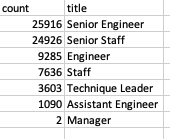
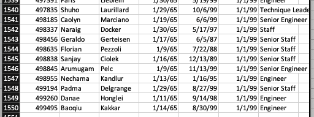
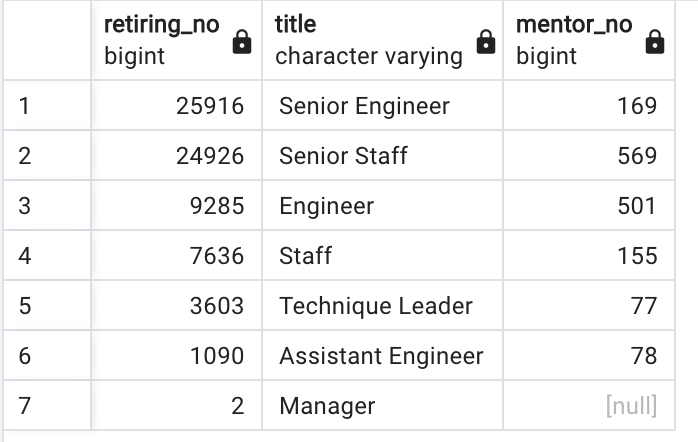
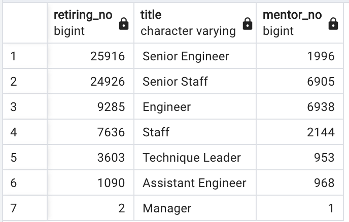

# Pewlett-Hackard-Analysis
## Overview of the Analysis
In the initial analysis, we used the existing csv files to create an employee database of tables on our own server. The new database allowed us to efficiently perform multple queries to help us identify employees who will be eligible to retire over the next few years. One of the recommendations we made was to consider a mentorship program where retiring staff would remain employed part-time while supporting staff transition into the vacant positions. After reviewing the initial results, the CEO asked us to determine how many employees would be retiring by title and identify those who are eligible to participate in the mentorship program.

We began by creating a list of retiring staff by title. We accomplished this in three steps.
1. We created a list that included the retiring employees, all titles they have held, and the start and end dates of each title.
2. We used the list from step 1 to create a new list that kept only the most recent title for each retiring staff. We needed to remove duplicates so the counts would be accurate.
3. Once the duplicates were removed, we created the final list of retiring staff by title. 

Next, we identfied the retiring employees who are eligible to participate in the mentorship program. To do this, we ran a quick query and created a new list of retiring employees who were born in 1965. 

## Results
- The aggregated results by title make it much easier to make sense of the upcoming "silver tsunami". There are approximately 72,000 employees who are approaching retirement. 

    
      
 -  The table reveals that Senior Engineers and Senior staff make up more than two-thirds, or about 50,000, of all identified staff.
 -  The mentorship eligibility table is hard to analyze because of its size. However, it does reveal that there are 1,549 retiring employees who are eligible to mentor the up and coming staff. That equates to just 2.1% of vacancies left by retiring staff. 
    
    

## Summary
We were tasked with answering two questions. First, how many roles will need to be filled as the "silver tsunami" begins to make an impact? Within the next few years, Pewlett-Hackard will lose 72,458 employees to retirement. Second, are there enough qualified, retirement-ready employees in the departments to mentor the next generation of PH employees? To answer this question, let's take a look at additional tables that we made. 

After reviewing the large list of eligible mentors, we decided to aggregate the data by title. To further accommodate analysis, we created a composite table that compares the number of retiring staff with the number of eligible mentors by title. The comparison table makes clear the wide divide between retiring staff and eligible mentors.

  
Eligible mentors were selected from the pool of retiring employees based solely on their birth year, 1965. This criteria appears to be too restrictive since that year's retirees only account for 2% of the total. In the following image, we reran the mentorship data and extended the mentorship eligibility to include employees born in 1964 and 1965. By extending eligibility by just one year, we increase the potential number of mentors to 19,905, or 27%. The extended comparison also suggests that mentorship eligibility should be tailored according to title. As the chart shows, applying the same criteria across the board results in some positions, like Senior Engineer, having too few mentors, while positions like Assistant Engineer have too many.

